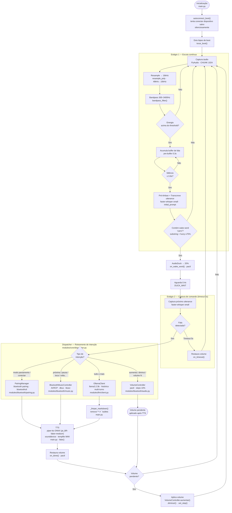

# Fluxo do Sistema — Palio-IA

Diagrama completo do fluxo de execução do assistente de voz, do boot à resposta.

## Módulos envolvidos

| Módulo | Papel no fluxo |
|---|---|
| `main.py` | Orquestrador: inicializa tudo, cria handlers, roda loop |
| `modules/stt/whisper_backend.py` | Estágios 1 e 2: captura, VAD, transcrição, detecção de wake word |
| `modules/core/dispatcher.py` | Classifica a intenção e roteia para o módulo correto |
| `modules/bluetooth/music.py` | Executa comandos AVRCP via dbus (próxima, pausa, play...) |
| `modules/bluetooth/pairing.py` | Gerencia pareamento e conexão BT por voz |
| `modules/bluetooth/audio.py` | Controla volume do sink padrão via pactl |
| `modules/bluetooth/audio_duck.py` | Duck 20% na wake word, restaura após TTS |
| `modules/llm/client.py` | Chat multi-turno com Ollama local |
| `speech_to_text.py` | Funções compartilhadas: resample, bandpass, pré-ênfase, fuzzy match, seleção de mic |
