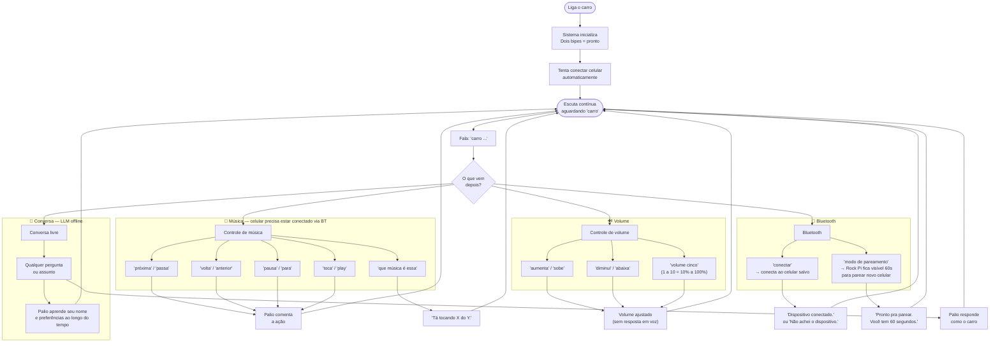

# Guia de Uso — Palio-IA

O que dá pra fazer com o assistente hoje, do ponto de vista de quem está no carro.

---

## Fluxo de uso

---

## Referência rápida de comandos

### Música
| Fala | Ação |
|---|---|
| `carro próxima` / `carro passa` | Pula para a próxima faixa |
| `carro volta` / `carro anterior` | Volta para a faixa anterior |
| `carro pausa` / `carro para` | Pausa a música |
| `carro toca` / `carro play` | Retoma a música |
| `carro que música é essa` | Fala o nome da faixa atual |

### Volume
| Fala | Ação |
|---|---|
| `carro aumenta` / `carro sobe` | +10% |
| `carro diminui` / `carro abaixa` | -10% |
| `carro volume cinco` | Define 50% (escala 1–10) |

### Bluetooth
| Fala | Ação |
|---|---|
| `carro conectar` | Conecta ao celular salvo em `data/devices.json` |
| `carro modo de pareamento` | Torna o Rock Pi visível por 60s para parear |

### Conversa
| Situação | Comportamento |
|---|---|
| Qualquer frase não reconhecida | Envia ao LLM local (Ollama `llama3.2:3b`) |
| Palio aprende seu nome | Salva em `data/brain.md` e lembra nas próximas sessões |
| Ollama offline | `"Meu cérebro tá offline agora."` — música e BT continuam |

---

## Notas de uso

- **Wake word**: sempre começa com `"carro"` — sem ela nenhum comando é executado
- **Timeout**: se não falar nada em até 5s após a wake word, volta a escutar normalmente
- **Boot automático**: ao ligar o carro, o sistema tenta conectar o celular salvo sozinho — sem precisar falar `"carro conectar"`
- **100% offline**: sem internet, sem nuvem, tudo roda no Rock Pi
